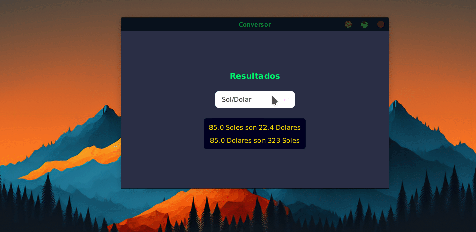
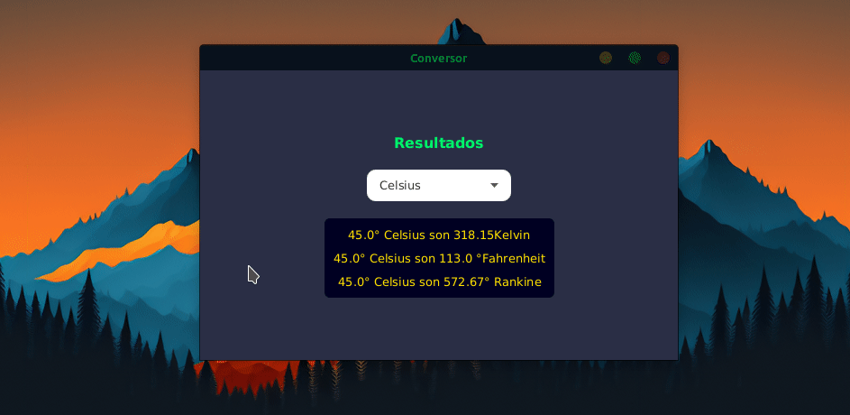

<h1 align="center">Challenge Currency converter</h1>

This is a challenge from the ONE (Oracle Next Education) program by Oracle, which is about a program that enables currency and temperature conversion.

The requested features are:

The currency converter should:

Convert your country's currency to USD.
Convert your country's currency to EUR.
Convert your country's currency to GBP.
Convert your country's currency to JPY.
Convert your country's currency to KRW.
Remembering that the reverse conversion should also be possible.

## Extra
The extra added in my project is the conversion of temperatures.

The temperature converter shows in a single result the conversion of Kelvin, Fahrenheit, Celsius, and Rankine, with the ability to change the unit of measurement from which the others will be calculated. 

## RESULTS

### Currency Converter

### Temperature Converter

